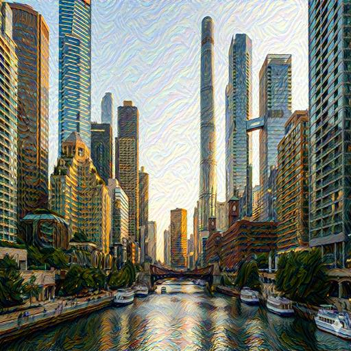

<div align="center">

# 🎨 Neural Style Transfer

### 用 AI 将照片转换为艺术杰作

*基于 Gatys 等人的经典论文 "A Neural Algorithm of Artistic Style"*

[](https://www.python.org/downloads/)
[](https://pytorch.org/)
[](LICENSE)

[特性](#-特性) • [安装](#-安装) • [使用](#-使用方法) • [原理](#-技术原理) • [示例](#-示例结果)

---

</div>

## 📖 项目简介

该项目使用**深度学习**实现艺术风格迁移，通过预训练的 **VGG19** 网络提取图像特征，将任意艺术作品的风格应用到您的照片上。

**核心功能：** 将"内容图"与"风格图"结合，生成保留内容结构但具有艺术风格的全新图像。

<br>

## ✨ 特性

<table>
<tr>
<td width="50%">

🧠 **智能特征提取**
- 基于 VGG19 深度网络
- 多层特征融合

🚀 **高性能计算**
- 自动 GPU 加速 (CUDA)
- 支持 Apple Silicon (MPS)
- CPU 后备支持

</td>
<td width="50%">

⚙️ **灵活配置**
- 可调节风格/内容权重
- 自定义图像尺寸
- 可控迭代次数

🎯 **开箱即用**
- 完整命令行工具
- 详细进度显示
- 简单易用的 API

</td>
</tr>
</table>

<br>

## 📋 环境要求

| 依赖 | 版本要求 |
|------|---------|
| 🐍 Python | 3.7+ |
| 🔥 PyTorch | 2.0+ |
| 👁️ torchvision | 0.15+ |
| 🖼️ Pillow | 9.0+ |

<br>

## 🚀 安装

**第一步：克隆项目**

```bash
git clone https://github.com/mikeywangzq/Neural-Style-Transfer.git
cd Neural-Style-Transfer
```

**第二步：安装依赖**

```bash
pip install -r requirements.txt
```

> 💡 **提示：** 推荐使用虚拟环境 (venv 或 conda) 来隔离依赖

<br>

## 🎯 使用方法

### 快速开始

只需一行命令，立即体验风格迁移的魔力：

```bash
python neural_style_transfer.py \
    --content path/to/content.jpg \
    --style path/to/style.jpg \
    --output output.jpg
```

### 高级定制

通过调整参数获得最佳效果：

```bash
python neural_style_transfer.py \
    --content path/to/content.jpg \      # 内容图片路径
    --style path/to/style.jpg \          # 风格图片路径
    --output output.jpg \                # 输出路径
    --imsize 512 \                       # 图像尺寸
    --steps 300 \                        # 优化步数
    --style-weight 1000000 \             # 风格权重
    --content-weight 1                   # 内容权重
```

### 📊 参数详解

| 参数 | 类型 | 默认值 | 说明 | 建议范围 |
|------|------|--------|------|----------|
| `--content` | str | **必需** | 内容图路径 | - |
| `--style` | str | **必需** | 风格图路径 | - |
| `--output` | str | `output.jpg` | 输出图像路径 | - |
| `--imsize` | int | `512` | 图像处理尺寸 (像素) | 256-1024 |
| `--steps` | int | `300` | 优化迭代次数 | 200-500 |
| `--style-weight` | float | `1000000` | 风格损失权重 | 1e5-1e7 |
| `--content-weight` | float | `1` | 内容损失权重 | 0.1-10 |

> ⚡ **调优技巧：**
> - 想要更强烈的风格？增大 `--style-weight`
> - 想要保留更多内容细节？增大 `--content-weight`
> - 图像太大内存不足？减小 `--imsize`

<br>

## 🔬 技术原理

### 网络架构

#### 🧠 特征提取网络

使用预训练的 **VGG19** 深度卷积网络：

```
📥 输入图像
  ↓
🔍 VGG19 特征提取
  ├─ 📌 内容层: conv4_2 (第 21 层)
  └─ 🎨 风格层: conv1_1, conv2_1, conv3_1, conv4_1, conv5_1
```

#### 📐 损失函数

```python
总损失 = α × 内容损失 + β × 风格损失
```

| 损失类型 | 计算方式 | 作用 |
|---------|---------|------|
| **内容损失** | 特征图 MSE | 保留图像内容结构 |
| **风格损失** | Gram 矩阵 MSE | 迁移艺术风格纹理 |

#### ⚙️ 优化过程

- **优化器**: Adam (lr=0.01)
- **优化目标**: 生成图像的像素值
- **迭代过程**: 逐步最小化总损失

### 关键技术实现

<details>
<summary><b>🔧 点击查看技术细节</b></summary>

<br>

**1️⃣ ReLU 层修改**
```python
# 替换 inplace=True 以支持梯度反向传播
ReLU(inplace=False)
```

**2️⃣ 图像归一化**
```python
# 使用 ImageNet 预训练标准
mean = [0.485, 0.456, 0.406]
std = [0.229, 0.224, 0.225]
```

**3️⃣ Gram 矩阵计算**
```python
# 捕捉风格信息的数学表示
G = F × F^T / (C × H × W)
```
其中 `F` 是特征图 (C, H×W)

</details>

<br>

## 📸 示例结果

<div align="center">

**内容图** + **风格图** → **风格化输出**

<table>
<tr>
<td align="center"><b>内容图</b></td>
<td align="center"><b>风格图</b></td>
<td align="center"><b>输出结果</b></td>
</tr>
<tr>
<td></td>
<td></td>
<td></td>
</tr>
</table>

*芝加哥城市风光 + 梵高《星夜》风格*

</div>

<br>

## ⚡ 性能优化建议

### 硬件加速

| 设备类型 | 自动检测 | 加速效果 |
|---------|---------|---------|
| 🎮 NVIDIA GPU (CUDA) | ✅ 是 | 🚀🚀🚀 极快 |
| 🍎 Apple Silicon (MPS) | ✅ 是 | 🚀🚀 很快 |
| 💻 CPU | ✅ 是 | 🐢 较慢 |

### 参数调优指南

```
图像尺寸建议：
├─ 快速预览: 256×256
├─ 标准质量: 512×512 ⭐ 推荐
└─ 高清输出: 1024×1024 (需要 GPU)

迭代次数建议：
├─ 快速测试: 100-200 步
├─ 标准质量: 300-400 步 ⭐ 推荐
└─ 精细调整: 500+ 步

权重调节技巧：
├─ 风格主导: style_weight = 1e7, content_weight = 1
├─ 平衡模式: style_weight = 1e6, content_weight = 1 ⭐ 推荐
└─ 内容主导: style_weight = 1e5, content_weight = 10
```

<br>

## 📚 参考文献

- **论文**: Gatys, L. A., Ecker, A. S., & Bethge, M. (2016). *"A Neural Algorithm of Artistic Style"*. [arXiv:1508.06576](https://arxiv.org/abs/1508.06576)
- **网络**: Simonyan, K., & Zisserman, A. (2014). *"Very Deep Convolutional Networks for Large-Scale Image Recognition"* (VGG19)

<br>

## 📄 许可证

本项目采用 [MIT License](LICENSE) 开源协议

<br>

## 🤝 贡献指南

欢迎贡献代码！请遵循以下步骤：

1. 🍴 Fork 本仓库
2. 🔧 创建特性分支 (`git checkout -b feature/AmazingFeature`)
3. 💾 提交更改 (`git commit -m 'Add some AmazingFeature'`)
4. 📤 推送到分支 (`git push origin feature/AmazingFeature`)
5. 🎉 提交 Pull Request

<br>

---

<div align="center">

**如果这个项目对你有帮助，请给一个 ⭐ Star！**

Made with ❤️ and PyTorch

</div>